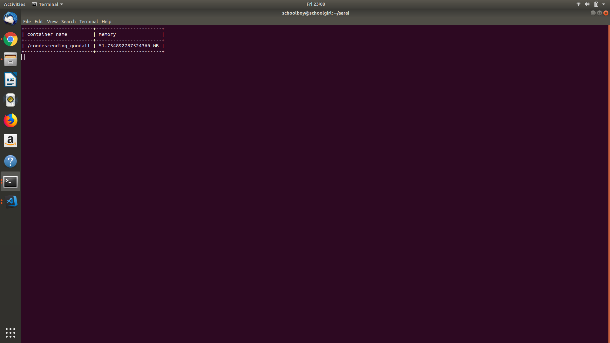

## aarai

Container memory Monitoring using eBPF and Rust.

This is not for production use. If you're interested in using ebpf monitoring,check sysdig monitoring. 

## Disclaimer
- PR won't be accepted.
- project won't be maintained. I just built it to learn rust and linux kernal.

[twitter handle](https://twitter.com/hi_balaji)